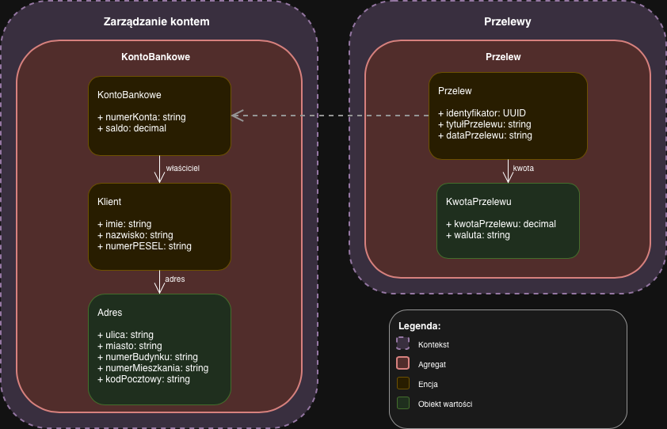

# ZADANIE 1 – DDD

W ramach zadania 1 zamodelowano fragment aplikacji bankowej z wykorzystaniem podejścia Domain Driven Design. Skupiono się na dwóch kontekstach: zarządzaniu kontem bankowym oraz obsłudze przelewów. Model obejmuje po jednym głównym agregacie w każdym kontekście oraz kilka prostych obiektów wartości. Celem jest pokazanie podziału domeny i podstawowych ograniczeń biznesowych, a nie pełne odwzorowanie systemu bankowego.

---

### Kontekst: Zarządzanie kontem  
Zawiera operacje związane z prowadzeniem konta bankowego (saldo, właściciel, numer konta).

**Agregat:** KontoBankowe  

**Encje:**
- KontoBankowe  
- Klient  

**Obiekty wartości:**
- Adres  

---

### Kontekst: Przelewy  
Zawiera operacje związane ze zlecaniem i realizacją przelewów.

**Agregat:** Przelew  

**Encje:**
- Przelew  

**Obiekty wartości:**
- KwotaPrzelewu  

---
### Diagram

---

## Przyjęte założenia

- **KontoBankowe** – reprezentuje rachunek klienta.
  - `numerKonta` – tylko cyfry, długość zgodna z formatem przyjętym w systemie (np. 26 cyfr).
  - `saldo` – wartość liczbowa (np. decimal).

- **Klient** – dane klienta będącego właścicielem konta.
  - `imie`, `nazwisko` – string, tylko litery, długość 2–50 znaków.
  - `numerPESEL` – tylko cyfry, dokładnie 11 znaków.

- **Adres** – wartość przypisana do Klienta.
  - `ulica`, `miasto` – string, tylko litery.
  - `numerBudynku`, `numerMieszkania` – string, znaki alfanumeryczne.
  - `kodPocztowy` – string, format `\d{2}-\d{3}` (np. 00-001).

- **Przelew** – pojedyncza transakcja.
  - `identyfikator` – UUID, unikatowy dla każdego przelewu.
  - `tytułPrzelewu` – string, znaki alfanumeryczne, maks. 140 znaków.
  - `dataPrzelewu` – string, format `YYYY-MM-DD HH:mm:ss`.

- **KwotaPrzelewu** – kwota w ramach przelewu.
  - `kwotaPrzelewu` – wartość liczbowa > 0, nie może przekroczyć salda konta nadawcy.
  - `waluta` – string, nazwa waluty (np. "PLN"), tylko litery, długość 3–10 znaków.
